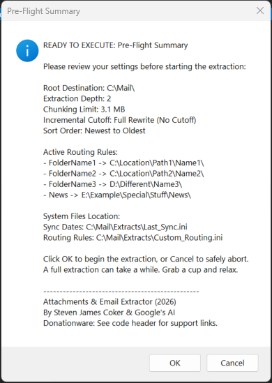

# Coker's Outlook Miner (Attachments & Email Extractor)

A highly customized Microsoft Outlook VBA macro designed to process massive email archives (e.g., 25+ years, 400,000+ items). This ETL (Extract, Transform, Load) engine dynamically extracts attachments, routes them to custom folders, and mathematically chunks email body text into AI-ready `.txt` files perfectly sized for ingest by tools like Google NotebookLM.

## Key Features

* **Universal Chunking Dial:** Set a specific MB limit (e.g., 2.8 MB) for output text files. The macro seamlessly splits massive email threads across sequential text files to prevent hitting the file-size limits of AI platforms.
* **Traffic Controller (Custom Routing):** An INI-driven routing system that allows you to send specific Outlook folder attachments (e.g., `!Genealogy` or `Finance`) to completely custom hard drive locations without touching the VBA code.
* **Privacy Isolation:** Automatically quarantines any folder starting with an underscore (e.g., `_Private`). These folders generate mathematically isolated text streams, preventing sensitive data from spilling into your primary LLM ingest files.
* **Incremental Syncing:** The macro remembers the timestamp of your last extraction for each specific depth setting. It will only process attachments newer than the cutoff date, saving hours of processing time on subsequent runs.
* **Registry Memory & Migration:** Automatically remembers your root save location (e.g., `S:\`) across sessions. If you change the destination to a new drive, it will intelligently offer to migrate your custom routing rules to the new location.
* **Ghost Attachment Protection:** Bypasses and logs "forever new" Outlook calendar items (like `.ics` files) that constantly refresh their modified dates, ensuring accurate extraction counts.

 

## Prerequisites
* Microsoft Outlook (Windows desktop client)
* Windows Operating System (Required for FileSystemObject and Windows Registry API calls)

## Installation Instructions

1. Download the `OutlookMiner.bas` file from this repository.
2. Open Outlook and press `ALT + F11` to open the VBA Editor.
3. In the project tree on the left, right-click `Project1` -> `Insert` -> `Module`.
4. Open the downloaded `.bas` file in any text editor (like Notepad), copy the entire contents, and paste them into the blank module window.
5. Close the VBA Editor.

## How to Use

1. Run the macro by pressing `ALT + F8` in Outlook, selecting `Attachments_Email`, and clicking **Run**.
2. Select the starting Outlook folder when prompted.
3. Follow the on-screen configuration menus to set your Root Destination, custom Traffic Controller routes, extraction depth, and Chunking MB limit.
4. Review the Pre-Flight Summary.
5. Click **OK** to execute the extraction. 

### Output Structure
The macro will automatically generate a clean directory architecture at your designated root location:
* `Extracts\Emails\Depth_2_2-8MB\` (Contains your sequentially numbered AI-ready text chunks)
* `Extracts\Attachments\` (Contains your extracted files, unless redirected by the Traffic Controller)
* `Extracts\Custom_Routing.ini` (Stores your folder-routing rules)
* `Extracts\Last_Sync.ini` (Stores the cutoff timestamps for your incremental syncs)

## License & Support

**Author:** Steven James Coker with code developed in collaboration with Google's AI (2026)  
**License:** Donationware. This program is free for non-commercial use. You may copy and distribute it freely. For commercial use inquiries, please contact the author.

If this tool saves you hours of manual data extraction and helps your work, please consider supporting the development:
* **PayPal:** paypal.com/paypalme/SJCoker
* **GoFundMe:** gofundme.com/f/genetic-genealogy
